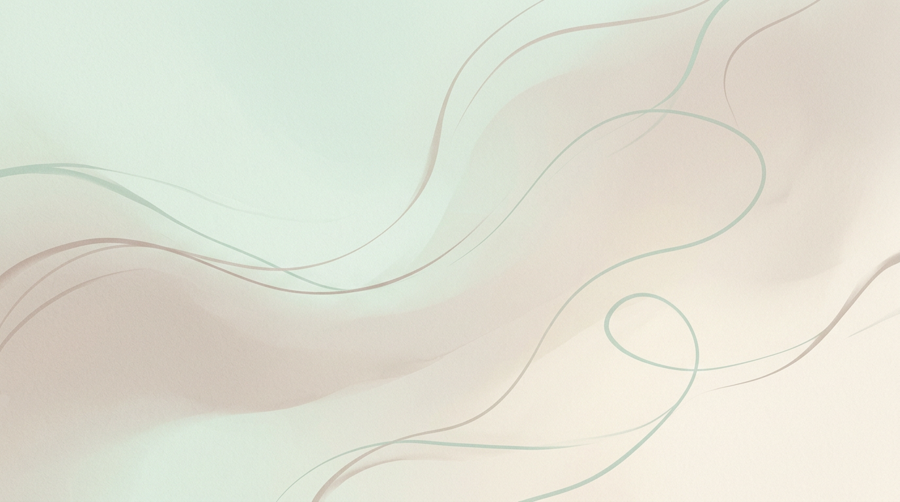

有些原生家庭带来的创伤，不是简单的“不被理解”，而是长期、系统性的索取。一个人从小就被当成工具、资源，甚至被安排好要为家里承担某种牺牲角色，那种消耗会深到骨头里。

有个很刺痛人的例子：有个女孩，名字里的“拦”并不是兰花的兰，而是“拦住”的拦。家里给她这样起名，只是希望后面别再生女孩。长大以后，她很早就被推去打工，挣来的钱大部分都要贴补家庭和弟弟。对这样的人来说，家庭从来不是退路，反而是一口持续抽血的井。

很多人在面对这样的故事时，第一反应是同情。但如果只停留在同情，往往解决不了问题。真正残酷的地方在于，这类关系之所以可怕，不仅因为过去亏待了你，更因为它会不断要求你继续证明忠诚、继续承担、继续把自己放回原位。

于是很多人明明已经成年，有收入，有独立生活的可能，却还是很难抽身。不是不知道痛，而是从小形成的心理结构，让他总觉得“我应该再忍一忍”“我不能太绝情”“他们再不好也是家人”。这种迟疑，恰恰是消耗得以延续的关键。

如果一个家庭长期只有索取，没有尊重；只有道德绑架，没有真正的照顾，那么最重要的功课就不是继续解释自己，而是重建边界。边界有时是沟通，有时是金钱上的止损，有时甚至就是物理上的拉开距离。先把自己从单向消耗里撤出来，才谈得上修复人生。

这并不意味着否认亲情，而是承认亲情也需要基本秩序。任何关系，一旦以吞噬一个人的前途、尊严和生命力为代价，就不能再被浪漫化。不是所有牺牲都值得歌颂，也不是所有忍耐都能换来回头。

真正走出这种困局的人，往往都有一个共同点：不再把自己的价值交给原来的家庭定义。他开始重新理解自己，重新分配资源，也重新决定谁可以靠近。这个过程很难，但它比继续被消耗更有希望。先学会站回自己这边，命运才会慢慢松动。
