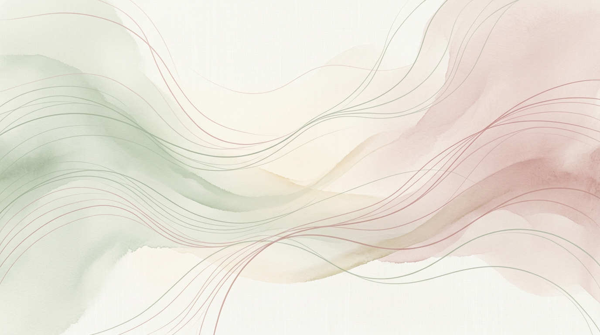

很多人把重伤、失利、背叛都当成纯粹的坏事，恨不得一生不要碰见一次。可真正拉开人与人差距的，往往不是顺的时候拿到什么，而是坏事来时，能不能从里面长出新的结构。

真正让人疼的，从来不只是损失本身，而是旧认知被瞬间击碎。原以为真心会换真心，结果被背叛；原以为努力就够，结果一场变故把多年积累打回原点。疼，是因为脑子里那套解释世界的办法不够用了。

所以苦难有时像一次强制更新。不是所有痛都会自动让人成长，但很多真正重要的成长，恰恰发生在不得不重装系统的时候。愿不愿意直面这个更新，决定了一个人是留在原地，还是借机变得更稳。

有些人在打击里只剩下抱怨，有些人则会逼自己多问一句：这次出事，到底暴露了哪块盲区，下一次该怎么补。前者把痛苦变成反复回放的伤口，后者把痛苦变成新能力的入口。

真正值得追求的，不是永远别受伤，而是每次受伤之后，都能把代价换成更清醒的判断、更硬的边界和更稳的心性。重伤未必是恩典，但若能从中完成升级，它就不只是损失。
